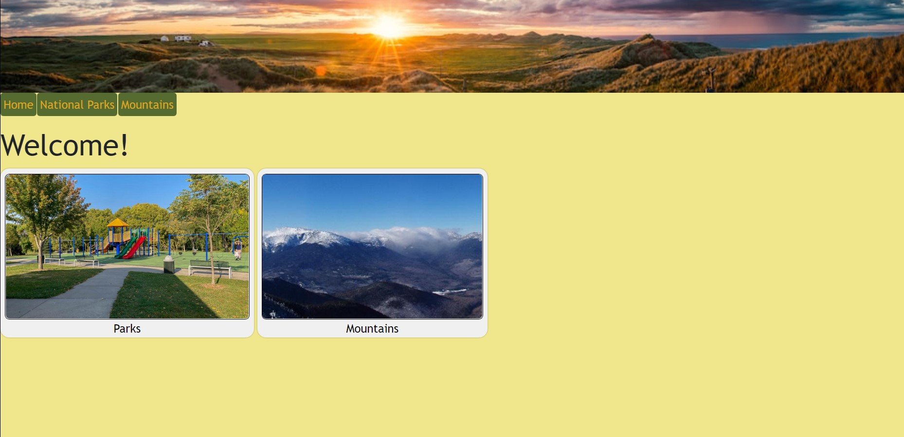
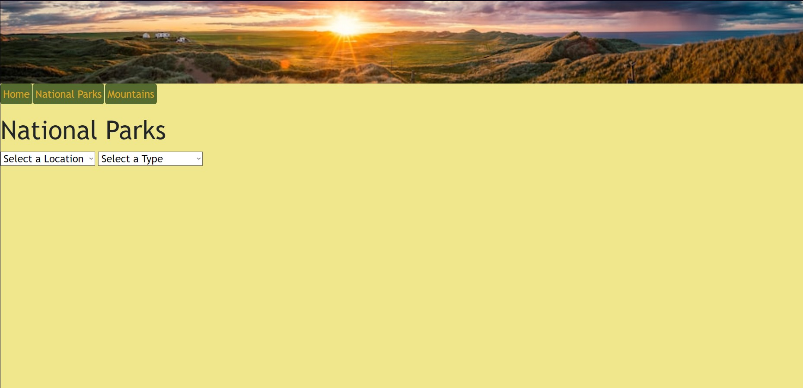
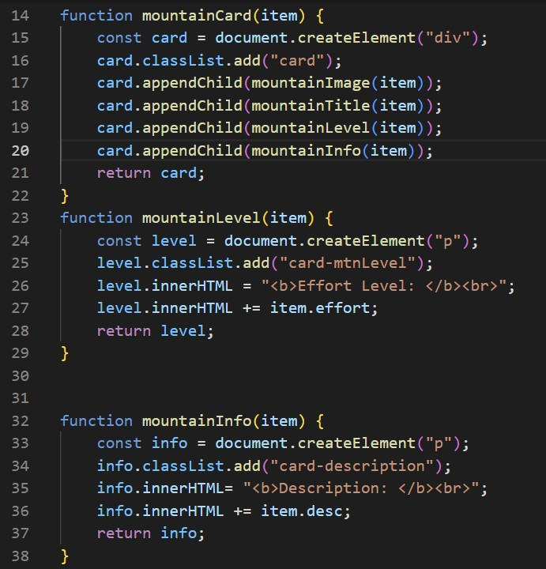

# EnjoyTheOutdoors
This project is used to show what I have learned about JavaScript and how I can properly implement it into a website. This website was created to inform visitors of many National Parks and Mountains, and what attractions they have.

